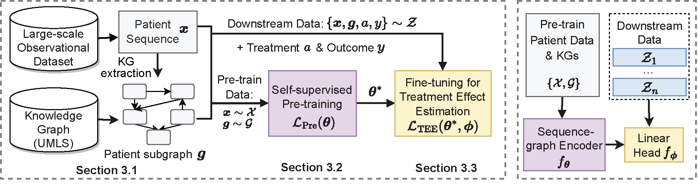

# KG-TREAT: Knowledge Graph Enhanced Pre-training for Treatment Effect Estimation

## Introduction
Code for paper "KG-TREAT: Knowledge Graph Enhanced Pre-training for Treatment Effect Estimation"

In this paper, we propose for the first time, a Knowledge Graph enhanced pre-training for TEE - namely KG-TREAT, a novel pre-training and fine-tuning framework that leverages both large-scale observational patient data and biomedical knowledge graphs (KGs). Specifically, KG-TREAT first extracts personalized subgraphs for each patient based on their observational covariates, then pre-trains the model on pairs of patient data and extracted KG subgraphs, and fine-tunes it on labeled data for TEE.



We obtain and preprocess 3M large-scale observational data ([MarketScan Research
Databases](https://www.ibm.com/products/marketscan-research-databases)), and relevant subgraphs from biomedical KGs ([UMLS](https://www.nlm.nih.gov/research/umls/index.html)) with 300K nodes and 1M edges as our pre-training data. We derive 4 downstream TEE tasks (10-20K patient samples) for evaluating the comparative treatment effectiveness for patients with coronary artery disease (CAD).

## Requirements
Create virtual environment and install the required dependencies by running the commands:
```bash
conda create -n kgtreat python=3.7
conda activate kgtreat
# check CUDA version via "nvcc --version"
pip install torch==1.10.1+cu111 -f https://download.pytorch.org/whl/torch_stable.html
pip install transformers==4.17.0 datasets==2.0.0 wandb
pip install torch-scatter torch-sparse torch-geometric torch-cluster -f https://pytorch-geometric.com/whl/torch-1.10.1+cu111.html
pip install scikit-learn==1.0.2 numpy==1.21.6 tqdm==4.64.1
```

## Pre-train KG-TREAT

```bash
python -m torch.distributed.launch --nproc_per_node=4 train.py 
    --fp16 
    --data_path data/cad/pretrain 
    --vocab_file data/cad/vocab.txt 
    --do_train 
    --num_train_epochs 2 
    --warmup_steps 20000 
    --learning_rate 1e-4 
    --overwrite_output_dir 
    --output_dir output/mcp_lp_v_g_bertbase 
    --use_kg 
    --mask_prediction 
    --link_prediction 
    --sep_graph 
    --per_device_train_batch_size 7 
    --validation_split_percentage 1 
    --logging_steps 100 
    --save_steps 40000 
    --max_seq_length 256 
    --max_node_num 200 
    --baseline_window 360 
    --cache_dir cache/ 
    --time_embedding 
    --ent_emb_paths data/umls/ent_emb_blbertL.npy 
```

## Fine-tune KG-TREAT for treatment effect estimation
```bash
python -m torch.distributed.launch --nproc_per_node=4 train.py
    --model_name_or_path output/mcp_lp_v_g_bertbase 
    --data_path data/cad/downstream 
    --target_drug Rivaroxaban.json 
    --compared_drug Aspirin.json 
    --vocab_file data/cad/vocab.txt 
    --do_train 
    --do_eval 
    --num_train_epoch 2 
    --learning_rate 5e-5 
    --overwrite_output_dir 
    --output_dir output/mcp_lp_v_g_bertbase_finetuned_outcome_prediction 
    --use_kg 
    --sep_graph
    --outcome_prediction 
    --per_device_train_batch_size 8 
    --validation_split_percentage 10 
    --cache_dir cache/ 
    --logging_steps 50 
    --max_seq_length 256 
    --max_node_num 200 
    --baseline_window 360 
    --overwrite_cache 
    --time_embedding 
```